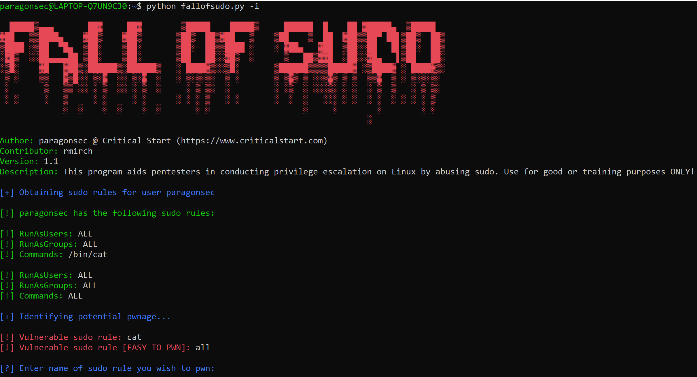

# FallofSudo



## Description
Welcome to the FallofSudo project! This has been developed to aid in the exploitation of Linux sudo rules. However, it should also be used in learning how to secure your sudo rules!

## Usage
This script has two functions:
  * Informational: By passing the ```-i``` command argument the program will show you how to exploit the specific sudo rule you are facing. This is the safest and most preferred way to use this script.
  * Autopwn: By passing the ```-a``` command argument the program will auto exploit the specific sudo rule you are facing. Be careful using this argument and ensure you know what you are doing!

## Disclaimer
This script should only be used on servers that you own or have explicit permission to do so.

## Contribution guidelines
Open an issue and we will get to it as quickly as we can. If you have a ton of additions please reach out to us and we can work together on getting it completed.
